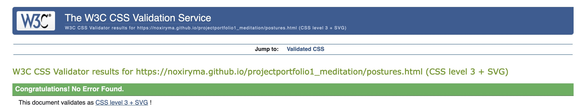
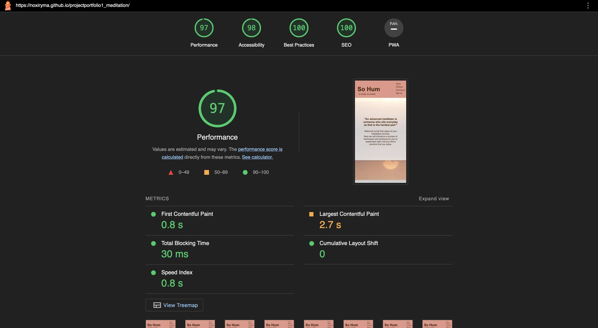
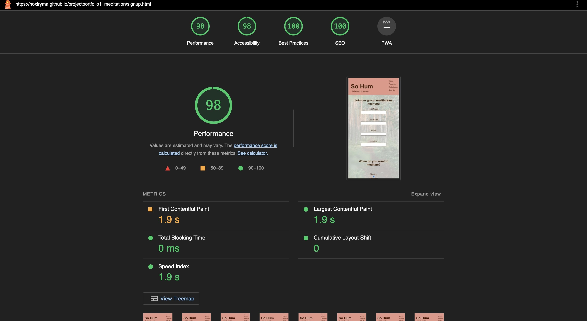

# Project Portfolio 1 - So Hum 
## A meditation for beginners website with a fictional meditation group 
### PP1 - Amy Rixon - 19/04/2024

## **[Live Site](https://noxiryma.github.io/projectportfolio1_meditation/index.html)**
## **[Repository](https://github.com/noxiryma/projectportfolio1_meditation)**

## Table of contents

1. [ UX ](#ux)
2. [ Features ](#features)  
3. [ Features Left to Implement ](#left)  
4. [ Technology used ](#tech) 
5. [ Testing ](#testing)  
6. [ Bugs ](#bugs)  
7. [ Deployment](#deployment)
8. [ Credits](#credits)
9. [ Content](#content)  
10. [ Acknowledgements](#acknowledgements)  

## About 

I chose the Project Example Idea 03 from the Project Portfolio 1 because meditation is something I am passionate about. Having just completed my yoga teacher training where meditation techniques was one of the modules we studied. I felt I could pass on this knowledge and information by building it into a website. 

I decided to create a website that was clear and concise about the instructions on how to begin meditating and gave the user simple techniques and postures to try and begin their meditation journey with. Because of my own meditation and yoga background I stress the importance of being comfortable as a practitioner as an uncomfortable meditation can lead to an unpleasant experience. It also runs the risk of injury over time. 

I included a brief history and benefits section to give more depth to the reason for wanting to become a meditator but also to show that it is accessible to everyone anywhere. So there’s no excuse not to try it! 

My main focus for the design was to create a calming user experience. I implemented a simple design structure and brought my creative abilities to the front in the layout of the design. I am passionate about photography too so chose to include pictures that are pleasing to the eye whilst complementing the colour scheme of the website. I tried to avoid loud and harsh colours and create a softer toned approach to the overall look. As meditation is a journey a lot of imagery is about choosing to start that journey by taking that path or looking out at the route you’re about to take as a meditation practitioner. 

There is also an element of joy and inclusion in the website by encouraging the user to sign up to a group meditation through the sign up page. Which gives the user a feel of community and should encourage them to continue with their practice. 

### Colour Scheme 

The colour scheme I chose for this website is one that is both warm, earthy and calming. The aim is to invite the user to have a relaxing experience whilst gaining information on the subject of meditation which whilst practicing this will also lead to a calm and clearer mind. 

The colours I chose were aided with the help of the website **[Color Mind](http://colormind.io/)** and the details of the three colours I chose for the content are as follows:

>A dark brown with a warm undertone: #401c04
>A terracota pink: #de8e8a
>Plain white: #ffffff

Images used for the website also compliment the main colour scheme of the design with rich warm tones and have a good contrast so the pictures are seen clearly. 

### Font 

The font family used for this site is 

"Montserrat Alternates", sans-serif; 

with a weight of 400 for the main content and a weight of 700 for the title header. Used to imply a logo for the site and give a clear heading.

The font was chosen for it’s accessibility as well as it’s design. The text is clear to read and has a more rounded style creating a smooth and relaxing experience for the user whilst they read and learn new information on the subject of meditation. 

## FEATURES

## Parallax

The initial design for the website was to have a main banner image at the introduction of each page followed by sections of information separated with a circular image accompanying them. During my first mentoring session where I had built the basis of the website and had started this design on my home page, my mentor advised I experiment with parallaxes and flipcards. After introducing a parallax on the home page as the introduction image I decided to make the whole page include the parallax feature with each new section of information there would be a new parallax image and each section would have a translucent white background with the text aligned centre of the page. 

## Flex 

Whilst I wanted to include this parallax feature throughout the website the postures.html page was an important page to have the images displayed clearly as the demonstrate information that the user would need to access. Not being able to see the visual information clearly this could lead the user to practicing the postures incorrectly and would go on to cause discomfort or injury over time. 

The images were aligned on the page using flex in css and are balanced through the page with images alternating positions on the page to demonstrate a new posture to try and section of information. 

I experimented in the building of the website with flipcards for the postures page but because it was important to include all the information regarding each posture along with their variations. The flipcards were too small but also didn’t fit the flow of the website so I chose to use the above method instead in portraying this information. 

### index.html 

The home page header contains a link to the home page with the title of the website. A favicon is used in the tab title of the webpage of a person sat in a meditation posture (an iconic visual link to the subject of the website). The navigation bar is positioned to the right, written in a list format in html and styled in css to display inline. 

There was spacing added between each of the links to make the text and title of each link clear as to where the user is navigating too with a border bottom feature added in css to highlight which page the user is currently on. A hover over feature has also been written to show the user which link they are about to click. 

In a responsive smaller screen from 320px to 768px the navigation menu moves to be stacked on top of one another but still with the feature of a border at the bottom of the active link. 

Each section of text is aligned to the centre with spacing between the lines of text added so it is clear and easy to read. 

The parallax feature encourages the user to keep scrolling down to the bottom of the page and the final image links with the sign up page as this section encourages the user to sign up to join group meditations which is a service this website offers for beginners. There is an internal link to the sign up page in this section. 

The footer contains links to social media websites where if this was an official website there would be a direct link to their pages demonstrating different techniques of meditation and motivation for the user. 

### postures.html 

The second page of the website was originally going to be regarding techniques but on thought of the layout of information it is better to be in the correct posture before implementing the practice. 

The layout of this page starts with a parallax and then displays clear images of each posture and has a rule of three in regards to the information given. Each section apart from the first and last has 3 subtitles of the subject clearly stated. Displaying what the posture is and the benefit, the method of getting into the posture and a variation should the user wish to make this posture more comfortable for them. 

In the responsive smaller screens the images are placed to fit the width of the screen and as the opening of each new posture. This was altered in the media query for screens up to the size of 768px. 

### techniques.html

The postures page is more important to have a visual instruction aid whereas this page it was more important to portray the information for the user via text. So the parallax feature was reintroduced on this page and flex was used to design the layout of each section to make them align in columns of three. The page starts off with an encouraging message for the user and an introduction to the approach they should have to meditation. In case the user skipped the postures page there is also an internal link in this introduction section called "Getting Started" to encourage them to head to that page. 

 

Each new technique has a new parallax image to clearly show the user they are moving on to the next technique along with a clear to read centred heading for each section. 

### signup.html 

The sign up page for the website has a clear heading to detail why and what the user is signing up for. As it was important to have relevant digital contact information only the email address and a location is asked for to determine where the user is located. Radio buttons were used to have the user select when and how often they wish to join the group meditations. Each field is required and has been tested before submission that all must be completed before submission. 

The parallax image used on the home page is used again on this page as the two sections are linked together and gives the user a visual link. 

The submit button has a hover over feature to change colour to show the user that they are about to click the link to submit. 

For a repsonsive screen the radio buttons move from being inline horizontally to being inline vertically. 

## Features left to implement

### Home Page 

In future I would like to add a responsive icon for the navigation menu for smaller screens so it is cleaner and less busy in the header on smaller screens. 

I would like to add links in the benefits section to studies made on meditation and their benefits. 

I would like to make the introduction quote changeable to be a different affirmation for the user to see each week. 

### Postures page 

I would like to have a video with subtitles accompanying each posture to give the user a live follow along to see how to get into each posture with clear instructions on variations and who these variations are good for. 

I would have liked to have had more consistent images of the same person or a more diverse range of people demonstrating each posture to show that meditation is for everyone. 

I would have liked to include a link to a business willing to be associated with the website who can sell the user props with a discount code link from this website. 

### Techniques 

I would like to have had a audio file or a video with subtitles to demonstrate each technique and to have something for the user to follow along with in real time. 

### Sign Up 

I would have liked to include an interactive map to help the user locate their nearest meditation group.

For the responsive smaller screens I would have liked to have had the radio buttons inline with their answers but still think the layout runs smoothly with the style of the website and the buttons are easy to identify their relationship to which answer. 

### Technology used  

### HTML

Used to build the structure of the web pages 

### CSS 

To style the website 

### Fontawesome 

For the social media icons for the footer 

### Googlefonts

For the selection and use of a font style for the website 

## Testing 

**Testing for links and form** 

| Test | Outcome |
|— | — |
| All internal links lead to the correct page | Yes |
| Footer social links all lead to a new tab opened to correct link | Yes |
| Sign Up form submits when all information completed correctly | Yes |
| Sign Up form does not submit when information completed incorrectly | Yes |

**Testing for responsiveness**
|—|—|
|Home, Postures, Techniques and Sign Up pages all display correctly on screens smaller than 768px | Yes |
|Home, Postures, Techniques and Sign Up pages all display correctly on screens bigger than 768px | Yes |

## HTML Validation Testing 

No errors were presented upon final testing in [HTML validator](https://validator.w3.org/). 

### index.html 

Results - no errors 

### postures.html 

Results - no errors

### techniques.html 

Results - no errors 

### signup.html 

Results - no errors 

## CSS Validation Testing 

No errors were presented upon final testing in [CSS Validator](https://jigsaw.w3.org/css-validator/)

Results - no errors 

### postures.html 

Results - no errors

### techniques.html 

Results - no errors 

### signup.html 

Results - no errors

## Google Lighthouse Testing 

### index.html 

### postures.html 

### techniques.html 

### signup.html 

## Safari 

Also tested the website on Safari and found the parallax does not flow as smoothly and jumps. The layout of the page remains consistent with other applications used (Firefox and Chrome). 

## Bugs 

Navigation menu in 320px screen size was creating screen gap and covering “So Hum” title **fixed**

Movement of techniques page below header whilst on mobile screen size of 320px **fixed**

Improved lighthouse testing by compressing images using web converter tool but still low on performance **partial fix**

Image for seated posture did not demonstrate posture clearly **fixed**

Some images did not deploy when changed to web format and identified file path was wrong in media query **fixed**

Icon for website not visible and too complicated in detail **fixed**

## Credits & Resources 

### [w3 schools](https://www.w3schools.com/)

Used for general tips and instructions on writing HTML and CSS 

### [Flexbox Froggy](https://flexboxfroggy.com/)

For experimenting with flex properties used in this website 

### [Code Institute](https://codeinstitute.net/full-stack-software-development-diploma/?utm_term=code%20institute&utm_campaign=CI%2B-%2BUK%2B-%2BSearch%2B-%2BBrand&utm_source=adwords&utm_medium=ppc&hsa_acc=8983321581&hsa_cam=1578649861&hsa_grp=62188641240&hsa_ad=635720257674&hsa_src=g&hsa_tgt=kwd-319867646331&hsa_kw=code%20institute&hsa_mt=e&hsa_net=adwords&hsa_ver=3&gad_source=1&gclid=EAIaIQobChMIysPPieLJhQMVl5VQBh2ZVQSEEAAYASAAEgJOn_D_BwE&nab=1&utm_referrer=https%3A%2F%2Fwww.google.com%2F) 

Project created through education for Project Portfolio 1 of the Full Stack Software Developer Diploma 

### [Font Awesome](https://fontawesome.com/)

Icons for the footer were taken from the Font Awesome website 

### [Google Fonts](https://fonts.google.com/specimen/Quicksand?preview.text=So%20Hum)

Font selected for website was taken from Google Fonts website 

### [Love Running Project](https://github.com/noxiryma/love_running_project)

Used as reference and for tips when writing HTML and CSS 

## Images

I used a number of sources to find the correct images for this website that complimented each other and continued with the theme of mediation throughout. Below are the direct links to the images used and a list of the sites I used. 

Upon searching for the correct images for the postures I found finding the relevant content that displayed the correct relationship with the posture and the text accompanying it quite tricky. If I was to build this website in future for a potential client I would arrange to have images taken specifically for the website thus keeping a continuous look and style throughout. 

[Pixabay](https://pixabay.com/)

[Unsplash](https://unsplash.com/)

[Pexels](https://www.pexels.com/)

[Freepik](https://www.freepik.com/)

## index.html

[Welcome image](https://pixabay.com/photos/balance-stones-stack-110850/)

[Lotus flower](https://pixabay.com/photos/flower-lotus-pond-white-flower-8173078/)

[Meditation monk hands](https://pixabay.com/photos/monk-hands-zen-faith-person-male-555391/)

## postures.html

[Opening image](https://unsplash.com/photos/black-and-grey-buddha-statue-on-top-of-hill-88IMbX3wZmI)

[Conditioning](https://www.pexels.com/photo/a-woman-doing-a-meditation-on-a-tree-log-during-morning-8964938/)

[Seated](https://www.pexels.com/photo/healthy-woman-relaxation-garden-6787202/)

[Lying down](https://www.freepik.com/free-photo/young-yogi-attractive-woman-savasana-pose-white-loft-backgro_1282145.htm#fromView=search&page=1&position=1&uuid=62c50582-f6c8-4894-a20c-e165bbac61b9)

[Standing](https://www.pexels.com/photo/woman-in-standing-savasana-pose-6298334/)

[Props](https://unsplash.com/photos/brown-leather-bean-bag-chair-9bPXsEgrdcg)

## techniques.html

[Getting started]( https://unsplash.com/photos/woman-sitting-on-cliff-overlooking-mountains-during-daytime-Zf0-90SpDD0)

[Counting](https://www.pexels.com/photo/close-up-shot-of-a-person-in-a-mudra-pose-6958260/)

[Focus](https://unsplash.com/photos/round-ceramic-bowl-with-lighted-candle-Pg2jm-PMVWs)

[Noting](https://pixabay.com/photos/yoga-meditation-vipassana-person-4849683/)

## Icon 

The icon I used for the website was sourced from [Free Images](https://www.freeimages.com/a8af63a9-f3b2-4e6a-bf10-79323bd457ef) and was converted into a favicon using the [Favicon Generator](https://favicon.io/favicon-converter/). 

## Acknowledgements 

### Alan Bushell 

Appointed as my mentor for my diploma. Alan gave me valuable feedback and answered every question that I had whilst giving encouragement and introduced me to a number of resources that I will use throughout my software career. 

### Stuart Crang 

Thank you for helping me start this journey.  
